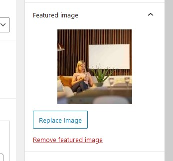
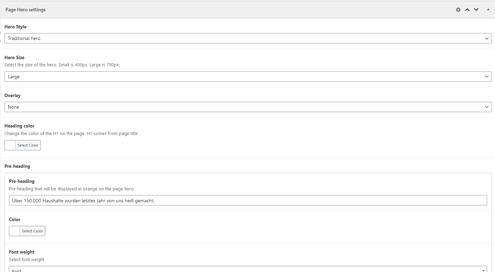
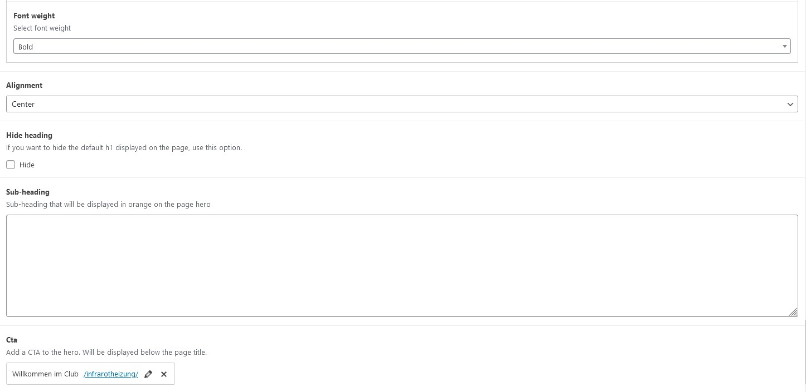

The hero is the big cover image shown on the top of the site. There are multiple styles that our hero supports.

### Image

The image that will be displayed in the hero comes from the page's featured image.

### Settings

The rest of the Hero settings can be adjusted via the dedicated panel, below the page editor.

#### Details

**Heading shadow**

When Heading color is set to white, a drop shadow will be added for better readability
